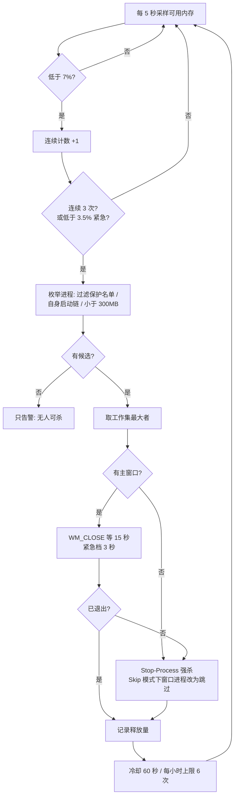

# memfuse（内存保险丝）


> **可用内存跌到临界、整机开始卡顿之前，杀掉当时占用最大的那一个进程**，把系统从悬崖边拉回来。
> 单文件 PowerShell（约 500 行），零依赖，克隆即用。**这是最后防线，不是内存优化器。**

名字取自保险丝：它不阻止过载，只在过载时**牺牲最大的那一个，保住整条电路**。

---

## 一、定位声明：它是什么，不是什么

先把边界说清楚，免得选错工具：

- 它**不清理**缓存、**不压缩**内存、**不"释放"**任何本该被占用的内存、不提升任何性能；
- 它承认一个前提：**空闲内存是浪费的内存**（Windows 的内存管理哲学）。可用内存低本身不是病；
- 它只在一种场景下有意义：**机器被少数失控进程拖到临界，且你接受牺牲它们**；
- 代价必须写在最前面：被杀进程的未保存工作会丢。这不是"优化"，是**止损**。

### 与同类工具的关系

| 工具 | 它的做法 | 与本项目的关系 |
|---|---|---|
| 任务管理器（手动结束进程） | 你自己选、自己杀 | **卡死时你打不开它** —— 这正是本项目存在的原因 |
| Mem Reduct 等"清工作集"工具 | 让进程把内存交还系统，不杀进程 | 互补：进程还能响应时用它；已经失控时用本项目 |
| "内存优化大师"类 | 清缓存 / 改注册表 / 宣称提速 | 不竞争：本项目不做任何"优化" |
| 页面文件 + 内存压缩（系统自带） | 系统级兜底 | 兜底的代价是全局换页卡顿；本项目在换页风暴**之前**动手 |
| 一堆 `auto-process-killer` 脚本 | 按阈值杀进程 | 差别不在"杀"，而在**守护者自身是否可靠**（见第四节） |

---

## 二、它怎么决策（四个问题）

### 1) 什么时候动手

| 级别 | 条件 | 动作 |
|---|---|---|
| WARN | 可用内存 < 12% | 只记日志（10 分钟去抖） |
| CRITICAL | 可用内存 < 7% **且连续 3 次采样**（5 秒一次） | 执行 |
| EMERGENCY | 可用内存 < 3.5% | 立即执行，不等确认 |

"连续 3 次"是防抖：一次大分配、一次页面回收都会让单次读数越线。紧急通道是为"来不及等 15 秒"的雪崩场景留的——它在真实使用中被触发过 10 次。

### 2) 动谁

按**工作集（Working Set）**降序取最大者，跳过小于 300MB 的进程。

300MB 地板的意义：如果连最大的进程都不到 300MB，说明内存不是被单进程吃掉的，杀谁都白杀——此时只告警，不动手。

### 3) 怎么动

先礼后兵，并留下证据：

1. 有主窗口的进程：先发 `WM_CLOSE`（等价于点窗口关闭按钮），给它 **15 秒**自己退出（紧急档只有 3 秒——没时间等人点保存）；
2. 超时或没有窗口：`Stop-Process -Force` 强杀；**若 `-WindowedAction Skip`，超时的窗口进程不会被强杀**，改试下一个候选；
3. 杀完等 3 秒，记录释放量（`before → after`）；
4. **每轮只杀一个**，冷却 60 秒；每小时最多 6 次。

第 3、4 条是防雪崩的关键：杀一个、观察、再决定，而不是一次清场。没有频率刹车，反复的"杀-重生"会变成无限互撕。

### 4) 谁不能杀

- **硬保护**：45 项系统关键进程（内核/会话、OS 基础设施、安全软件）+ 脚本自身启动链（防止守护把自己的终端一起杀掉）；
- **软保护**：`protect-list.txt`，每行一个进程名；**运行期按修改时间重读**，`-AddProtect node,code` 或手改文件都即时生效，不用重启守护；
- **应用进程默认不保护**——这是策略选择，不是遗漏。保护名单不是技术问题，而是"谁有权决定杀掉用户的哪个程序"的问题：默认只硬保护"杀了会立刻蓝屏/注销/破坏系统"的最小集合，其余的取舍交还使用者。



---

## 三、真正的难点：守护者自己死了怎么办

一个"定时任务 + 杀进程"的脚本半小时能写完。难的是另一个问题：

> **当你需要它的时候，它还在不在？**

内存守护脚本最讽刺的失效方式是：某天系统真的卡死了，你去看日志——它三周前就悄悄退出了。

三层保障：

1. **开机自启**：登录时启动（`AtLogOn`）；
2. **心跳自愈**：一次性触发器 + **每 5 分钟无限重复**，配合 `MultipleInstances=IgnoreNew`（单实例）——守护活着时心跳是 no-op（不会起第二个实例）；它一旦死了，下一次心跳（≤5 分钟）自动把它拉回来；
3. **防被动停止**：`ExecutionTimeLimit=0`（永不超时终止）、电池模式不中断、失败自动重试 999 次。

自愈实测：手动杀掉守护进程（模拟崩溃）→ **4 分 46 秒后**新守护进程自动出现，全程无人工介入；同期间的心跳在守护存活时被正确忽略，没有出现第二个实例。

### 踩到的两个坑（PowerShell + 任务计划）

**坑一：`-RepetitionDuration` 不能是 `TimeSpan::MaxValue`。** 想当然地写"无限重复"，注册会直接失败：

```text
Register-ScheduledTask : The task XML contains a value which is
incorrectly formatted or out of range.
(10,42):Duration:P99999999DT23H59M59S
```

正解：**省略 `-RepetitionDuration` 参数**——空的 Duration 就表示无限重复。

**坑二：只用 `AtLogOn` 触发器时 `NextRunTime` 是空的。** 因为"已登录"状态下"下次登录"无法计算。改用"一次性触发器 + 重复间隔"作为心跳源后，`NextRunTime` 每 5 分钟正常滚动——"自愈是否在生效"从不可观察变成可观察。

---

## 四、真实战报（不是演示数据）

以下全部来自本机日志文件（2026-09-19 ~ 09-23，跨 5 天；日志按天滚动）：

| 指标 | 数值 |
|---|---|
| 成功终止进程 | **64 次** |
| 紧急通道触发（< 3.5%，不等 15 秒确认） | 10 次 |
| 候选被拒（access denied）→ 自动顺延下一个 | 9 次 |
| 每小时 6 次上限被真实拦住 | 17 次 |
| 被终止的最大进程 | **7.9 GB 工作集**（OneDrive.Sync.Service，8085 MB） |
| 单次最大观测释放 | **9.3 GB**（见下方口径说明） |
| 最低可用内存时刻 | **383 MB（1.2%）** |
| 累计观测释放 | ≈ 91 GB |

> 口径说明：`delta`（释放量）是"杀完 3 秒后可用内存的变化"，**不等于被杀进程的工作集**——进程退出会连带触发系统回收（缓存释放、其他进程缩容）。例如 09-22 21:19 终止的是一个 497MB 的进程，但可用内存回升了 9483MB。

三段原文摘录（已去掉本机路径）：

```text
# ① 极限时刻：可用内存只剩 1.2%
2026-09-20 10:45:20 CRITICAL(emergency) avail 383MB (1.2%) commit 67.9% total 32002MB
  - candidates: OneDrive.Sync.Service#16288=5946MB | Tabbit Browser#30496=1061MB | ...
2026-09-20 10:45:25 ACTION  stopped OneDrive.Sync.Service pid=16288
  - avail 383MB (1.2%) -> 8460MB (26.4%) [delta 8077MB]

# ② 候选被拒 → 自动顺延（第一名没权限，就试下一个）
2026-09-22 07:43:58 CRITICAL avail 1974MB (6.2%) commit 43.5% total 32002MB
  - candidates: MarvisKnowledgebase#14052=846MB | node#30552=794MB | ...
2026-09-22 07:43:59 ACTION  failed to stop MarvisKnowledgebase pid=14052 (access denied or still busy)
  - trying next candidate
2026-09-22 07:44:04 ACTION  stopped node pid=30552
  - avail 1974MB (6.2%) -> 2530MB (7.9%) [delta 556MB]

# ③ 频率刹车：没有它，反复的"杀-重生"会变成无限互撕
2026-09-22 08:05:08 LIMIT hourly kill limit reached (6/h) - not acting this round
```

三个安全机制都不是"设计上写了"，而是**出厂前就被真实触发过**。另外，同一台机器上 `OneDrive.Sync.Service` 在三天里三次涨到 4~8GB（09-20 / 09-22 / 09-23）——它处理的不是一次性事故，而是每天都会回来的病灶。

上线第一天的日志也值得留着：先干跑（`dryRun=True`），把阈值当实验调（35%/30% → 45%/40% → 12%/7%），确认"想杀的都是谁"之后才开火。**这个工具的第一个功能是演练模式。**

### 它的代价：我因此改了工作流

诚实比功能重要，说说它带来的真实麻烦：

1. **它杀过我正在跑的构建。** 09-22 16:28~16:34 的 6 分钟里终止了 5 个进程，其中 3 个是我正在跑的构建：`next build`、`tsc --noEmit`、`eslint` —— 构建期是内存峰值期，正好是它最想动手的时刻。应对不是放宽阈值（那等于让它在该动手时不动手），而是**本地不再跑构建，交给 CI**。
2. **它杀过 `git status -z -uall`。** 这个命令在 11 万文件的工作区能吃近 1GB（被终止 4 次，675~913MB，日志里都留着完整命令行）。这不是守护的错，但它让这个事实变得可见。
3. **提权进程杀不掉。** 微信、豆包等以更高权限运行的进程会返回 access denied（实测 9 次），脚本会自动顺延到下一个候选。想覆盖它们，脚本（或计划任务）必须同样以管理员身份运行。

---

## 五、已知局限（roadmap）

1. **判据单一：只看可用物理内存。** 真正接近"卡死"的信号其实是**提交内存（commit）压力**与硬错误页速率——本机高压时段 commit 一度到 72%。当前脚本把 commit **记录进日志**，但**没有纳入判定**。这是 roadmap，不是已完成特性。
2. **"杀进程"永远是最后手段**，不适用于日常内存管理（见第一节定位）。
3. **杀叶子会被重生。** 日志里有一个反复被杀又反复回来的后台服务（Electron 主进程托管的 node gateway，被杀后 **9 秒**重生）：按内存排序只能选到叶子（真正吃内存的工作进程），而根进程往往只有一两百 MB，排在候选之外。**杀叶子=白杀（会被重生），杀根=有效（等于关掉用户整个应用）**——没有免费的午餐。
4. **不保证保存数据。** `WM_CLOSE` 只是替你点了关闭按钮，用户可能来不及保存；无窗口的后台进程直接强杀。
5. **只终止当前用户有权限终止的进程**，且不做任何"通知-等待-宽限"之外的协商。

---

## 六、快速开始

```powershell
# 0) 先演练：什么都不杀，只告诉你会杀谁（强烈建议先跑几天）
powershell -NoProfile -ExecutionPolicy Bypass -File .\memory-guard.ps1 -Once -DryRun
powershell -NoProfile -ExecutionPolicy Bypass -File .\memory-guard.ps1 -DryRun -Verbose

# 1) 前台正式运行
powershell -NoProfile -ExecutionPolicy Bypass -File .\memory-guard.ps1

# 2) 注册守护任务（登录自启 + 5 分钟心跳自愈；不需要管理员）
powershell -NoProfile -ExecutionPolicy Bypass -File .\memory-guard.ps1 -InstallTask

# 3) 卸载
powershell -NoProfile -ExecutionPolicy Bypass -File .\memory-guard.ps1 -UninstallTask

# 4) 在乎未保存的工作？先看清谁握着窗口，再点名保护（改完即生效，不用重启）
powershell -NoProfile -ExecutionPolicy Bypass -File .\memory-guard.ps1 -ListWindowed
powershell -NoProfile -ExecutionPolicy Bypass -File .\memory-guard.ps1 -AddProtect node,code
powershell -NoProfile -ExecutionPolicy Bypass -File .\memory-guard.ps1 -ListProtected
```

全部参数（默认值见括号）：`-WarnPercent`(12) `-CriticalPercent`(7) `-SustainSamples`(3) `-IntervalSec`(5) `-CooldownSec`(60) `-MinCandidateMB`(300) `-MaxKillsPerHour`(6) `-GracefulSeconds`(15) `-WindowedAction`(Close) `-Protect node,code` `-ProtectFile .\protect-list.txt` `-AddProtect` `-ListProtected` `-ListWindowed` `-DryRun` `-Once` `-NoSelfProtect`

文件：

```text
memory-guard.ps1        主脚本（单文件；文件名保持与本机实测版本一致，未随仓库改名）
protect-list.sample.txt 保护名单样本 → 复制为 protect-list.txt 使用
logs\memory-guard-YYYYMMDD.log   运行日志
<桌面>\memory-guard-alert.txt    每次动手后的留档：杀了谁、前后可用内存、路径、完整命令行、如何把它加进保护名单
```

采样用 `Add-Type` P/Invoke 直读 kernel32 的 `GlobalMemoryStatusEx`：不起子进程、不调 CIM，**零依赖**（不需要 Python / psutil / .NET SDK），单次采样成本近乎为零。

---

### 在一台新机器上第一次运行

依赖层面是零依赖：只需要 Windows 10/11 自带的 PowerShell 5.1，**不需要 Python / .NET SDK / 管理员权限**，干净目录里放一个 `.ps1` 就能跑（运行期只多一个 `logs\` 目录，白名单文件可以不存在）。

但 Windows 对新下载的脚本有两道闸，先过闸再跑：

| 你会看到的报错 | 原因 | 处理 |
|---|---|---|
| `... is not digitally signed. You cannot run this script on the current system.` | 文件带"来自 Internet"标记（Mark-of-the-Web），而策略是 `RemoteSigned` | 用仓库里的 **`memfuse.cmd`** 启动（内部已带 `-ExecutionPolicy Bypass`），或先 `Unblock-File .\memory-guard.ps1` |
| `... cannot be loaded because running scripts is disabled on this system.` | Windows 客户端出厂默认策略 `Restricted` | 同上：`memfuse.cmd`，或显式 `-ExecutionPolicy Bypass`，或 `Set-ExecutionPolicy -Scope Process Bypass` |

`git clone` 过来的文件不带 Mark-of-the-Web，只需处理策略那一行。**两种闸都不需要改机器全局策略**——`memfuse.cmd` 与文档里的 `-ExecutionPolicy Bypass` 都是按次生效的。

第一步永远先演练（不杀任何东西）：

```bat
memfuse.cmd -Once -DryRun
memfuse.cmd -ListWindowed
memfuse.cmd -InstallTask
```

`-InstallTask` 不需要管理员；若企业策略禁止注册计划任务，它会打印 `ERROR  task registration failed: ...` 并退出，不会静默失败。

### 复现验证

`-WindowedAction` 的两种语义有可复现的端到端测试（不是看代码，是做实验）：

```powershell
powershell -NoProfile -ExecutionPolicy Bypass -File .\tests\windowed-protection.ps1
```

它会起一个**主动忽略关闭请求**的窗口进程（tkinter，约 250MB），再用临时白名单把机器上其余进程名全部保护起来——于是守护只剩这一个候选：`Skip` 阶段断言它存活，`Close` 阶段断言它被强杀。测试不需要管理员，不碰仓库里的 `protect-list.txt`，日志落在 `%TEMP%`，桌面告警文件测前备份、测后还原。没有 Python（含 tkinter）时它会干净地输出 `[SKIP]` 退出。

## 七、安全警告

- **先 `-DryRun` 跑几天**，看清"它想杀的都是谁"，再决定是否开火。
- 它**真的会杀掉你的程序，未保存的工作会丢**。默认保护名单只保证"不会杀掉让系统蓝屏/注销/破坏安全软件"的最小集合——**你的应用进程不在保护范围内**。
- 想保住某个进程，写进 `protect-list.txt`（或 `-AddProtect <name>`）；代价是：它也可能正是内存临界时最大的那个占用者。
- **在乎未保存的工作？三条路，从轻到重**：① `-ListWindowed` 看清谁握着窗口 → `-AddProtect` 点名保护；② `-WindowedAction Skip`：有窗口的进程一律不强杀（代价是机器可能仍然很紧）；③ 调大 `GracefulSeconds`（默认 15 秒），给"保存 / 放弃"对话框更多时间。紧急档（可用内存 < 3.5%）只有 3 秒——那是最坏情况下的取舍，写在明处。
- 默认只在你自己的权限范围内生效；以管理员身份运行 = 它也能杀提权进程，请自行评估。

---

## 八、进一步阅读

- 设计复盘（含"守护者自身的可靠性"、策略三次反转、杀-重生循环根因）：[最后一道内存防线：内存守护脚本的设计取舍与真实战报](https://joker1point.github.io/techlog/blog/memory-guard-last-line-of-defense)
- 姊妹项目：[portwatch](https://github.com/joker1point/portwatch)（谁占着端口）、[flowwatch](https://github.com/joker1point/flowwatch)（谁在用带宽）——同一套本地可观测性思路的三个切面。

## License

MIT
